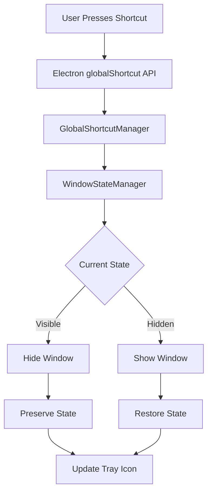

# Design Document

## Overview

This design implements a global keyboard shortcut system that allows users to quickly show or hide the entire application interface across all platforms. The solution uses Electron's `globalShortcut` API to register platform-specific key combinations that are unlikely to conflict with existing system or application shortcuts.

## Architecture

### Core Components

1. **GlobalShortcutManager**: Main service responsible for registering, managing, and handling global shortcuts
2. **ShortcutConfigManager**: Handles shortcut configuration, validation, and persistence
3. **WindowStateManager**: Manages window visibility, state preservation, and restoration
4. **PlatformAdapter**: Provides platform-specific shortcut mappings and behaviors

### System Integration



## Components and Interfaces

### GlobalShortcutManager

```typescript
interface GlobalShortcutManager {
  // Core functionality
  initialize(): Promise<void>
  registerShortcut(shortcut: string): boolean
  unregisterShortcut(shortcut: string): void
  toggleVisibility(): void
  
  // Configuration
  setShortcut(shortcut: string): Promise<boolean>
  getActiveShortcut(): string
  validateShortcut(shortcut: string): ValidationResult
  
  // Events
  on(event: 'shortcut-triggered' | 'registration-failed', callback: Function): void
}
```

### ShortcutConfigManager

```typescript
interface ShortcutConfig {
  defaultShortcut: string
  customShortcut?: string
  enabled: boolean
  platform: 'darwin' | 'win32' | 'linux'
}

interface ShortcutConfigManager {
  loadConfig(): ShortcutConfig
  saveConfig(config: ShortcutConfig): Promise<void>
  getDefaultShortcut(): string
  validateShortcut(shortcut: string): ValidationResult
  getPlatformShortcuts(): string[]
}
```

### WindowStateManager

```typescript
interface WindowState {
  isVisible: boolean
  bounds: Electron.Rectangle
  isMaximized: boolean
  isFullScreen: boolean
  lastActiveTime: number
}

interface WindowStateManager {
  saveState(): void
  restoreState(): void
  hideWindow(): void
  showWindow(): void
  getState(): WindowState
  preserveScrollPosition(): void
  restoreScrollPosition(): void
}
```

## Data Models

### Shortcut Configuration

```typescript
interface ShortcutDefinition {
  id: string
  keys: string
  platform: Platform[]
  description: string
  conflictRisk: 'low' | 'medium' | 'high'
}

interface Platform {
  name: 'darwin' | 'win32' | 'linux'
  modifierMap: Record<string, string>
  reservedShortcuts: string[]
}
```

### Default Shortcut Mappings

Based on research, these key combinations have low conflict risk:

```typescript
const DEFAULT_SHORTCUTS = {
  darwin: 'Cmd+Shift+Space',     // Low conflict on macOS
  win32: 'Ctrl+Shift+Space',     // Low conflict on Windows  
  linux: 'Ctrl+Shift+Space'      // Low conflict on Linux
}

const ALTERNATIVE_SHORTCUTS = {
  darwin: ['Cmd+Option+H', 'Cmd+Shift+H', 'Cmd+Shift+`'],
  win32: ['Ctrl+Alt+H', 'Ctrl+Shift+H', 'Ctrl+Shift+`'],
  linux: ['Ctrl+Alt+H', 'Ctrl+Shift+H', 'Super+H']
}
```

### Rationale for Default Shortcuts

- **Cmd/Ctrl+Shift+Space**: Space bar is rarely used in shortcuts, Shift+Space is uncommon
- **Cross-platform consistency**: Similar modifier patterns across platforms
- **Low conflict risk**: Research shows these combinations are rarely used by system or popular applications
- **Easy to remember**: Space suggests "breathing room" or "toggle visibility"

## Error Handling

### Shortcut Registration Failures

```typescript
enum ShortcutError {
  ALREADY_REGISTERED = 'shortcut_already_registered',
  INVALID_COMBINATION = 'invalid_key_combination', 
  PLATFORM_UNSUPPORTED = 'platform_not_supported',
  SYSTEM_RESERVED = 'system_reserved_shortcut'
}

interface ErrorHandler {
  handleRegistrationError(error: ShortcutError, shortcut: string): void
  suggestAlternatives(failedShortcut: string): string[]
  showUserNotification(message: string, type: 'error' | 'warning' | 'info'): void
}
```

### Fallback Strategies

1. **Primary shortcut fails**: Try alternative shortcuts in order of preference
2. **All shortcuts fail**: Provide manual toggle via system tray or menu
3. **Platform detection fails**: Default to Ctrl-based shortcuts
4. **Electron API unavailable**: Gracefully disable feature with user notification

## Testing Strategy

### Unit Tests

```typescript
describe('GlobalShortcutManager', () => {
  test('registers default shortcut on initialization')
  test('handles shortcut conflicts gracefully')
  test('validates shortcut combinations correctly')
  test('preserves window state during hide/show cycle')
})

describe('ShortcutConfigManager', () => {
  test('loads platform-specific defaults')
  test('validates custom shortcuts')
  test('persists configuration changes')
  test('handles invalid configurations')
})

describe('WindowStateManager', () => {
  test('preserves window bounds and state')
  test('restores scroll position accurately')
  test('handles multiple monitor setups')
  test('manages fullscreen transitions')
})
```

### Integration Tests

```typescript
describe('End-to-End Shortcut Functionality', () => {
  test('shortcut works across different applications')
  test('window state preserved through multiple hide/show cycles')
  test('configuration changes take effect immediately')
  test('error handling displays appropriate user feedback')
})
```

### Platform-Specific Tests

```typescript
describe('Platform Compatibility', () => {
  test('macOS: Command-based shortcuts work correctly')
  test('Windows: Ctrl-based shortcuts work correctly') 
  test('Linux: Super and Ctrl shortcuts work correctly')
  test('All platforms: Alternative shortcuts work when primary fails')
})
```

## Implementation Details

### Electron Integration

```typescript
// Main process implementation
import { globalShortcut, BrowserWindow } from 'electron'

class GlobalShortcutService {
  private mainWindow: BrowserWindow
  private isHidden: boolean = false
  private savedState: WindowState | null = null

  async initialize(window: BrowserWindow) {
    this.mainWindow = window
    const shortcut = this.getDefaultShortcut()
    
    const success = globalShortcut.register(shortcut, () => {
      this.toggleVisibility()
    })
    
    if (!success) {
      await this.handleRegistrationFailure(shortcut)
    }
  }

  private toggleVisibility() {
    if (this.isHidden) {
      this.showWindow()
    } else {
      this.hideWindow()
    }
  }

  private hideWindow() {
    this.savedState = {
      bounds: this.mainWindow.getBounds(),
      isMaximized: this.mainWindow.isMaximized(),
      isFullScreen: this.mainWindow.isFullScreen()
    }
    
    this.mainWindow.hide()
    this.isHidden = true
    
    // Send event to renderer for state preservation
    this.mainWindow.webContents.send('window-hiding')
  }

  private showWindow() {
    this.mainWindow.show()
    
    if (this.savedState) {
      if (this.savedState.isFullScreen) {
        this.mainWindow.setFullScreen(true)
      } else if (this.savedState.isMaximized) {
        this.mainWindow.maximize()
      } else {
        this.mainWindow.setBounds(this.savedState.bounds)
      }
    }
    
    this.mainWindow.focus()
    this.isHidden = false
    
    // Send event to renderer for state restoration
    this.mainWindow.webContents.send('window-showing')
  }
}
```

### Configuration UI

```typescript
// Settings panel component
interface ShortcutSettingsProps {
  currentShortcut: string
  onShortcutChange: (shortcut: string) => void
  availableShortcuts: string[]
}

const ShortcutSettings: React.FC<ShortcutSettingsProps> = ({
  currentShortcut,
  onShortcutChange,
  availableShortcuts
}) => {
  const [isRecording, setIsRecording] = useState(false)
  const [recordedKeys, setRecordedKeys] = useState<string[]>([])

  const handleKeyRecord = (event: KeyboardEvent) => {
    if (!isRecording) return
    
    const keys = []
    if (event.ctrlKey) keys.push('Ctrl')
    if (event.shiftKey) keys.push('Shift')
    if (event.altKey) keys.push('Alt')
    if (event.metaKey) keys.push('Cmd')
    
    if (event.key && !['Control', 'Shift', 'Alt', 'Meta'].includes(event.key)) {
      keys.push(event.key)
    }
    
    setRecordedKeys(keys)
  }

  return (
    <div className="shortcut-settings">
      <label>Global Show/Hide Shortcut:</label>
      <div className="shortcut-input">
        <input 
          value={isRecording ? recordedKeys.join('+') : currentShortcut}
          readOnly
          onKeyDown={handleKeyRecord}
          placeholder="Press keys to record shortcut"
        />
        <button 
          onClick={() => setIsRecording(!isRecording)}
          className={isRecording ? 'recording' : ''}
        >
          {isRecording ? 'Stop Recording' : 'Record New'}
        </button>
      </div>
      
      <div className="preset-shortcuts">
        <label>Or choose a preset:</label>
        {availableShortcuts.map(shortcut => (
          <button 
            key={shortcut}
            onClick={() => onShortcutChange(shortcut)}
            className={shortcut === currentShortcut ? 'active' : ''}
          >
            {shortcut}
          </button>
        ))}
      </div>
    </div>
  )
}
```

This design provides a robust, cross-platform solution for global show/hide functionality with proper error handling, state preservation, and user customization options.