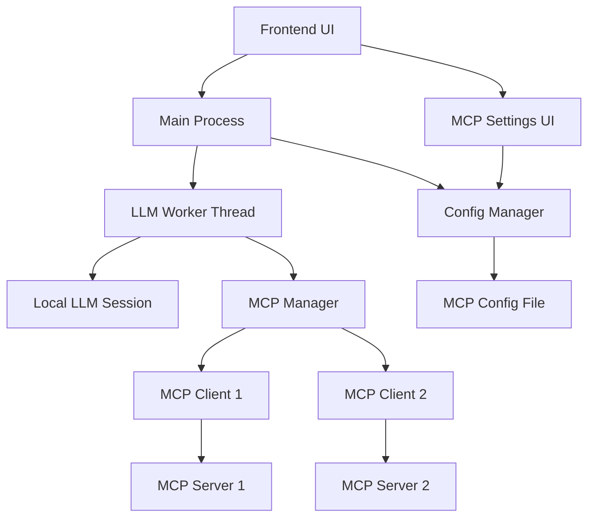

# Design Document

## Overview

The MCP Client Integration adds Model Context Protocol support to Insighto, enabling the AI to access external tools, resources, and prompts through MCP servers. This integration extends the existing function calling system in the LLM worker to seamlessly incorporate MCP tools alongside local functions.

The design leverages the `mcp-client` library for protocol handling and integrates with the existing `node-llama-cpp` function calling system to provide a unified interface for both local and remote capabilities.

## Architecture

### High-Level Architecture



### Component Interaction Flow

1. **Configuration**: User configures MCP servers through settings UI
2. **Initialization**: MCP Manager connects to configured servers on startup
3. **Function Discovery**: MCP tools are discovered and registered alongside local functions
4. **Function Calling**: LLM chooses between local and MCP functions during conversations
5. **Execution**: Function calls are routed to appropriate handlers (local or MCP)
6. **Response Integration**: Results are formatted consistently and returned to the LLM

## Components and Interfaces

### 1. MCP Configuration Manager

**Location**: `mcp-config-manager.js`

**Responsibilities**:
- Load and save MCP server configurations
- Validate server configurations
- Provide configuration to other components

**Interface**:
```javascript
class MCPConfigManager {
  constructor(configPath)
  
  // Configuration management
  async loadConfig()
  async saveConfig(config)
  validateServerConfig(serverConfig)
  
  // Server management
  getEnabledServers()
  updateServerStatus(serverId, status)
  
  // Events
  on(event, callback) // 'config-changed', 'server-status-changed'
}
```

### 2. MCP Manager

**Location**: `mcp-manager.js`

**Responsibilities**:
- Manage multiple MCP client connections
- Handle connection lifecycle (connect, disconnect, reconnect)
- Aggregate tools and resources from all servers
- Route function calls to appropriate servers

**Interface**:
```javascript
class MCPManager {
  constructor(configManager)
  
  // Connection management
  async initialize()
  async connectToServers()
  async disconnectFromServers()
  async reconnectServer(serverId)
  
  // Tool and resource discovery
  async getAllTools()
  async getAllResources()
  async getAllPrompts()
  
  // Function execution
  async callTool(toolName, parameters)
  async getResource(uri)
  async getPrompt(name, arguments)
  
  // Status and monitoring
  getConnectionStatus()
  on(event, callback) // 'tool-called', 'connection-changed'
}
```

### 3. MCP Function Adapter

**Location**: `mcp-function-adapter.js`

**Responsibilities**:
- Convert MCP tools to node-llama-cpp function format
- Handle parameter validation and conversion
- Format MCP responses for LLM consumption

**Interface**:
```javascript
class MCPFunctionAdapter {
  // Convert MCP tools to function calling format
  static convertMCPToolsToFunctions(mcpTools)
  static createFunctionHandler(mcpManager, toolName)
  
  // Parameter and response handling
  static validateParameters(tool, parameters)
  static formatResponse(mcpResponse)
  static handleError(error, toolName)
}
```

### 4. Enhanced LLM Worker

**Location**: `llm-worker.js` (modified)

**Responsibilities**:
- Integrate MCP functions with local functions
- Handle function calling with both local and MCP tools
- Manage function calling context and results

**Key Modifications**:
```javascript
// Add MCP integration to existing worker
const mcpManager = new MCPManager(configManager);
const mcpFunctions = await MCPFunctionAdapter.convertMCPToolsToFunctions(
  await mcpManager.getAllTools()
);

// Combine local and MCP functions
const allFunctions = {
  ...localFunctions,
  ...mcpFunctions
};

// Use in LLM session
const response = await session.prompt(prompt, { functions: allFunctions });
```

### 5. MCP Settings UI

**Location**: `mcp-settings.js` (frontend)

**Responsibilities**:
- Provide UI for MCP server configuration
- Test server connections
- Display server status and available tools

**Interface**:
```javascript
class MCPSettingsUI {
  // UI management
  render()
  showServerForm(server = null)
  hideServerForm()
  
  // Server management
  async addServer(serverConfig)
  async updateServer(serverId, serverConfig)
  async removeServer(serverId)
  async testConnection(serverConfig)
  
  // Status display
  updateServerStatus(serverId, status)
  displayAvailableTools(serverId, tools)
}
```

## Data Models

### MCP Server Configuration

```javascript
{
  id: "server-unique-id",
  name: "Server Display Name",
  enabled: true,
  connection: {
    type: "stdio" | "httpStream",
    // For stdio
    command: "node",
    args: ["server.js", "--port", "8080"],
    env: { PORT: "8080" },
    // For httpStream
    url: "http://localhost:8080/mcp"
  },
  authentication: {
    type: "none" | "bearer" | "basic",
    token: "bearer-token", // for bearer
    username: "user", // for basic
    password: "pass"  // for basic
  },
  settings: {
    timeout: 30000,
    retryAttempts: 3,
    retryDelay: 1000
  },
  status: {
    connected: false,
    lastConnected: null,
    error: null,
    toolCount: 0,
    resourceCount: 0
  }
}
```

### MCP Function Definition

```javascript
{
  name: "mcp_server_tool_name",
  description: "Tool description from MCP server",
  parameters: {
    type: "object",
    properties: {
      param1: { type: "string", description: "Parameter description" }
    },
    required: ["param1"]
  },
  metadata: {
    serverId: "server-id",
    originalName: "tool_name",
    mcpTool: true
  }
}
```

## Error Handling

### Connection Errors
- **Server Unreachable**: Implement exponential backoff retry logic
- **Authentication Failure**: Display clear error messages and disable server
- **Protocol Errors**: Log detailed errors and attempt reconnection

### Function Call Errors
- **Tool Not Found**: Gracefully handle missing tools and inform LLM
- **Parameter Validation**: Validate parameters before sending to MCP server
- **Timeout Handling**: Implement timeouts for MCP tool calls
- **Server Disconnection**: Handle mid-call disconnections gracefully

### Error Response Format
```javascript
{
  success: false,
  error: {
    type: "connection" | "validation" | "timeout" | "server",
    message: "Human-readable error message",
    details: "Technical details for debugging",
    serverId: "server-id",
    toolName: "tool-name"
  }
}
```

## Testing Strategy

### Unit Tests
- **MCP Config Manager**: Configuration loading, validation, and saving
- **MCP Function Adapter**: Tool conversion and parameter handling
- **MCP Manager**: Connection management and tool aggregation

### Integration Tests
- **End-to-End Function Calling**: Test complete flow from LLM to MCP server
- **Multiple Server Handling**: Test with multiple MCP servers simultaneously
- **Error Scenarios**: Test connection failures, timeouts, and recovery

### Manual Testing
- **UI Testing**: MCP settings interface and server management
- **Performance Testing**: Function calling latency and throughput
- **Compatibility Testing**: Test with various MCP server implementations

## Security Considerations

### Authentication
- Store credentials securely using Electron's safeStorage API
- Support multiple authentication methods (bearer, basic, none)
- Validate server certificates for HTTPS connections

### Input Validation
- Validate all MCP server configurations before saving
- Sanitize function parameters before sending to MCP servers
- Validate MCP server responses before processing

### Network Security
- Implement request timeouts to prevent hanging connections
- Use secure connection methods when available
- Log security-relevant events for monitoring

## Performance Optimizations

### Connection Management
- Maintain persistent connections to MCP servers
- Implement connection pooling for HTTP-based servers
- Use keep-alive mechanisms where supported

### Function Calling
- Cache tool definitions to avoid repeated discovery calls
- Implement parallel function calling for independent operations
- Use streaming responses where supported by MCP servers

### Resource Management
- Limit concurrent MCP connections
- Implement memory limits for cached responses
- Clean up unused connections automatically

## Configuration File Structure

**Location**: `.kiro/settings/mcp.json`

```json
{
  "version": "1.0",
  "servers": {
    "server-id-1": {
      "name": "Example Server",
      "enabled": true,
      "connection": {
        "type": "stdio",
        "command": "uvx",
        "args": ["example-mcp-server@latest"],
        "env": {}
      },
      "settings": {
        "timeout": 30000,
        "retryAttempts": 3
      }
    }
  },
  "global": {
    "enableMCP": true,
    "defaultTimeout": 30000,
    "maxConcurrentConnections": 5,
    "logLevel": "info"
  }
}
```

This design provides a robust, scalable foundation for MCP integration while maintaining compatibility with the existing Insighto architecture and function calling system.