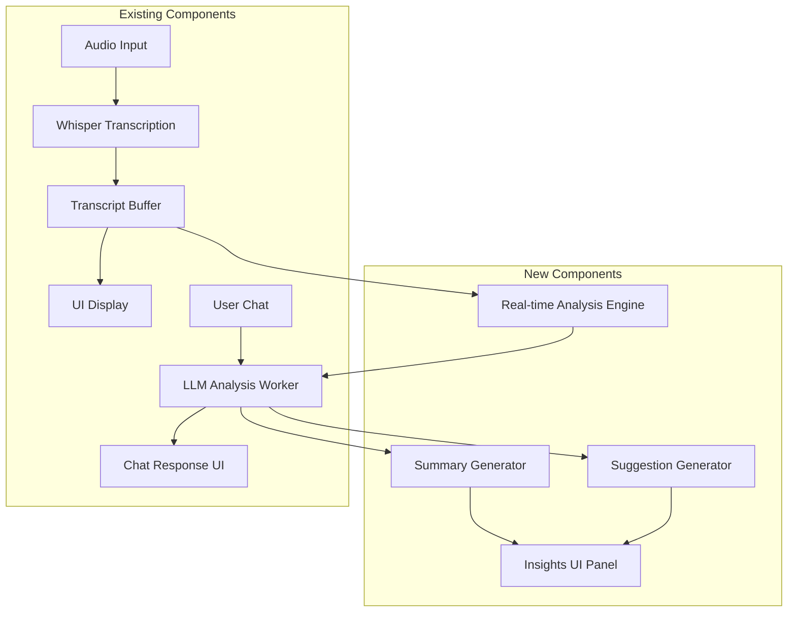

# Design Document

## Overview

The real-time AI insights feature extends the existing Electron-based transcription and LLM chat application by adding intelligent analysis capabilities that run in parallel with live transcription. The system will process transcript segments at regular intervals (approximately every minute) to generate contextual summaries and actionable suggestions without disrupting the core transcription functionality.

The design leverages the existing LLM infrastructure (node-llama-cpp with Gemma model) and introduces a new analysis pipeline that operates independently of user-initiated chat interactions. This ensures that real-time insights don't interfere with manual LLM queries while providing continuous value to users.

## Architecture

### High-Level Architecture



### Component Integration

The new analysis system integrates with existing components as follows:

1. **Transcript Buffer Enhancement**: Extends the current transcript handling to maintain a rolling buffer of transcript segments with timestamps
2. **LLM Worker Extension**: Adds analysis capabilities to the existing `llm-worker.js` without disrupting chat functionality
3. **UI Panel Addition**: Introduces a new insights panel alongside the existing chat interface
4. **Analysis Scheduler**: Implements a timing mechanism to trigger analysis at configurable intervals

## Components and Interfaces

### 1. Transcript Buffer Manager

**Purpose**: Manages transcript segments with timing information and provides data to the analysis engine.

**Key Methods**:
- `addTranscriptSegment(text, timestamp)`: Adds new transcript content
- `getSegmentsSince(timestamp)`: Retrieves transcript segments for analysis
- `getFullContext()`: Returns complete session transcript for context-aware analysis
- `clearBuffer()`: Resets buffer for new sessions

**Data Structure**:
```javascript
{
  segments: [
    {
      text: string,
      timestamp: Date,
      analyzed: boolean
    }
  ],
  sessionStart: Date,
  lastAnalysisTime: Date
}
```

### 2. Analysis Engine

**Purpose**: Coordinates the timing and execution of AI analysis tasks.

**Key Methods**:
- `scheduleAnalysis()`: Sets up interval-based analysis triggers
- `triggerAnalysis()`: Manually initiates analysis
- `updateSettings(config)`: Applies user configuration changes
- `pauseAnalysis()` / `resumeAnalysis()`: Controls analysis state

**Configuration Options**:
```javascript
{
  analysisInterval: number, // milliseconds (default: 60000)
  enableSummaries: boolean,
  enableSuggestions: boolean,
  suggestionTypes: string[], // ['action-items', 'questions', 'topics']
  minTranscriptLength: number // minimum characters before analysis
}
```

### 3. LLM Analysis Worker Extension

**Purpose**: Extends existing LLM worker to handle analysis requests alongside chat requests.

**New Message Types**:
- `analyze-transcript`: Request for summary and suggestions
- `analysis-response`: Response containing insights
- `analysis-error`: Error handling for analysis failures

**Analysis Request Format**:
```javascript
{
  type: 'analyze-transcript',
  id: string,
  transcript: string,
  context: string, // previous summaries/context
  analysisType: ['summary', 'suggestions'],
  timeRange: { start: Date, end: Date }
}
```

### 4. Summary Generator

**Purpose**: Creates concise summaries of transcript segments using structured prompts.

**Prompt Template**:
```
Analyze the following conversation transcript and provide a concise summary of key points discussed:

Context from previous summaries: {context}
Current transcript segment: {transcript}
Time range: {timeRange}

Please provide:
1. Main topics discussed
2. Key decisions or conclusions
3. Important information shared
4. Any notable changes in conversation direction

Keep the summary under 150 words and focus on actionable insights.
```

### 5. Suggestion Generator

**Purpose**: Generates contextual suggestions based on conversation content.

**Suggestion Categories**:
- **Action Items**: Tasks or follow-ups mentioned or implied
- **Questions**: Clarifying questions or topics to explore further
- **Topics**: Related subjects that might be worth discussing
- **Resources**: Tools, documents, or references that might be helpful

**Prompt Template**:
```
Based on this conversation transcript, provide relevant suggestions:

Transcript: {transcript}
Context: {context}

Generate suggestions in these categories:
1. Action Items: Specific tasks or follow-ups
2. Questions: Clarifying questions to ask
3. Topics: Related subjects to explore
4. Resources: Helpful tools or references

Format as JSON with categories and prioritize by relevance.
```

### 6. Insights UI Panel

**Purpose**: Displays summaries and suggestions in an organized, non-intrusive interface.

**UI Components**:
- **Summary Timeline**: Chronological list of generated summaries
- **Active Suggestions**: Current relevant suggestions organized by type
- **Settings Panel**: Configuration options for analysis behavior
- **Manual Trigger**: Button to force immediate analysis

**Layout Integration**:
The insights panel will be added as a collapsible section in the existing widget, maintaining the current compact design while providing expandable detail views.

## Data Models

### TranscriptSegment
```javascript
{
  id: string,
  text: string,
  timestamp: Date,
  duration: number, // milliseconds
  analyzed: boolean,
  confidence: number // from Whisper
}
```

### Summary
```javascript
{
  id: string,
  content: string,
  timeRange: { start: Date, end: Date },
  keyTopics: string[],
  timestamp: Date,
  transcriptSegments: string[] // references to source segments
}
```

### Suggestion
```javascript
{
  id: string,
  type: 'action-item' | 'question' | 'topic' | 'resource',
  content: string,
  priority: 'high' | 'medium' | 'low',
  context: string, // relevant transcript excerpt
  timestamp: Date,
  dismissed: boolean
}
```

### AnalysisSession
```javascript
{
  sessionId: string,
  startTime: Date,
  summaries: Summary[],
  suggestions: Suggestion[],
  settings: AnalysisConfig,
  transcriptBuffer: TranscriptSegment[]
}
```

## Error Handling

### Analysis Failures
- **LLM Unavailable**: Continue transcription, queue analysis for retry
- **Insufficient Content**: Skip analysis cycle, log for debugging
- **Parsing Errors**: Fallback to basic text extraction, notify user
- **Memory Constraints**: Implement buffer size limits, archive old data

### Performance Degradation
- **High CPU Usage**: Reduce analysis frequency automatically
- **Memory Leaks**: Implement cleanup routines for old analysis data
- **Network Issues**: Handle model loading failures gracefully

### User Experience
- **Visual Indicators**: Show analysis status without blocking UI
- **Graceful Degradation**: Core features remain functional if analysis fails
- **Error Recovery**: Automatic retry mechanisms with exponential backoff

## Testing Strategy

### Unit Testing
- **Transcript Buffer**: Test segment management and retrieval
- **Analysis Engine**: Verify timing and configuration handling
- **Prompt Generation**: Validate template rendering and content formatting
- **Data Models**: Test serialization and validation

### Integration Testing
- **LLM Worker Communication**: Test message passing and response handling
- **UI Updates**: Verify real-time display of insights
- **Settings Persistence**: Test configuration save/load functionality
- **Error Scenarios**: Simulate failures and verify recovery

### Performance Testing
- **Memory Usage**: Monitor buffer growth and cleanup effectiveness
- **CPU Impact**: Measure analysis overhead on transcription performance
- **Response Times**: Ensure analysis doesn't block user interactions
- **Concurrent Operations**: Test analysis running alongside chat queries

### User Acceptance Testing
- **Insight Quality**: Validate summary accuracy and suggestion relevance
- **Timing Appropriateness**: Verify analysis intervals feel natural
- **UI Usability**: Test insights panel integration and navigation
- **Configuration Effectiveness**: Ensure settings provide meaningful control

### End-to-End Testing
- **Full Session Flow**: Test complete transcription and analysis cycle
- **Session Persistence**: Verify data retention across app restarts
- **Multi-Modal Usage**: Test simultaneous transcription, chat, and analysis
- **Edge Cases**: Handle very short/long conversations, topic changes, silence periods