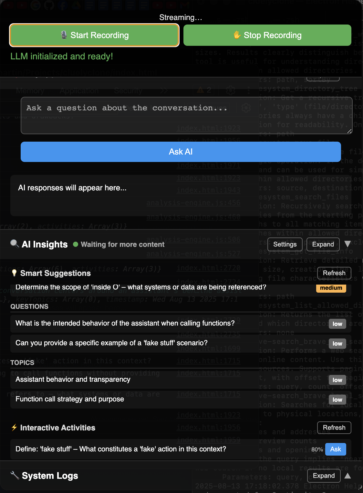

# Insighto

<p align="center">
  
</p>

An AI-powered transcription and analysis tool built with Electron, featuring local LLM processing, real-time audio transcription, and extensible MCP (Model Context Protocol) integration.

## Features

### 🎙️ Audio Transcription
- Real-time audio recording and transcription using Whisper
- Support for multiple audio formats
- Automatic transcript management and storage

### 🤖 Local LLM Processing
- Local AI chat interface with transcript context
- Intelligent transcript analysis and insights
- Performance-optimized request queuing system
- Support for both chat and analysis workflows

### ⌨️ Global Shortcuts
- **macOS**: `Cmd+Shift+Space` to show/hide the application
- **Windows/Linux**: `Ctrl+Shift+Space` to show/hide the application
- Quick access from anywhere in the system

### 🔌 MCP (Model Context Protocol) Integration
- Extensible plugin system for external tools and services
- Built-in support for:
  - Filesystem operations
  - Brave Search API integration
- Configuration management UI
- Server connection testing and validation

### 🎨 Modern UI
- Transparent overlay window with blur effects
- Resizable and draggable interface
- Always-on-top functionality for quick access
- Custom app icon and branding

## Model Management

The application uses the Gemma 3 4B IT model in GGUF format for local LLM processing. The model file will be automatically downloaded when you run the application.

### Model Details:
- **Name**: gemma-3-4b-it-Q4_0.gguf
- **Source**: https://huggingface.co/unsloth/gemma-3-4b-it-GGUF/
- **Location**: `models/gemma-3-4b-it-Q4_0.gguf`
- **Size**: ~2.5GB (quantized for optimal performance)

### Manual Model Download

If you want to download the model manually:

```bash
node download-model.js
```

## MCP Configuration

MCP servers are configured in `.insighto/settings/mcp.json`. The application includes:

- **Filesystem Server**: File system operations and management
- **Brave Search**: Web search capabilities with API integration

You can add, remove, or configure MCP servers through the application's settings interface.

## Development

### Prerequisites
- Node.js (v16 or higher)
- npm or yarn

### Setup

```bash
# Install dependencies
npm install

# Run the application (includes automatic model download)
npm start

# Test app icon functionality
npm run test-icon

# Build for distribution
npm run build
```

### Project Structure

```
insighto/
├── main.js              # Main Electron process
├── index.html           # Application UI
├── llm-worker.js        # LLM processing worker thread
├── preload.js           # Electron preload script
├── mcp-manager.js       # MCP server management
├── mcp-config-manager.js # MCP configuration handling
├── model-downloader.js  # Automatic model downloading
├── models/              # LLM model storage
├── icons/               # Application icons
└── .insighto/
    └── settings/
        └── mcp.json     # MCP server configuration
```

## Usage

1. **Launch**: Run `npm start` or use the built application
2. **Global Access**: Use `Cmd+Shift+Space` (Mac) or `Ctrl+Shift+Space` (Windows/Linux) to show/hide
3. **Record**: Click the record button to start audio transcription
4. **Chat**: Interact with the AI using your transcripts as context
5. **Analyze**: Use the analysis features for deeper insights
6. **Configure**: Access MCP settings to add external tools and services

## Building for Distribution

```bash
# Build for current platform
npm run build

# Build specifically for macOS
npm run build-mac
```

The built application will be available in the `dist/` directory.

## Technical Details

- **Framework**: Electron with Node.js backend
- **AI Model**: Gemma 3 4B IT (GGUF format) via node-llama-cpp
- **Audio Processing**: Whisper via nodejs-whisper
- **UI**: Modern web technologies with native system integration
- **Architecture**: Multi-threaded with worker processes for AI operations